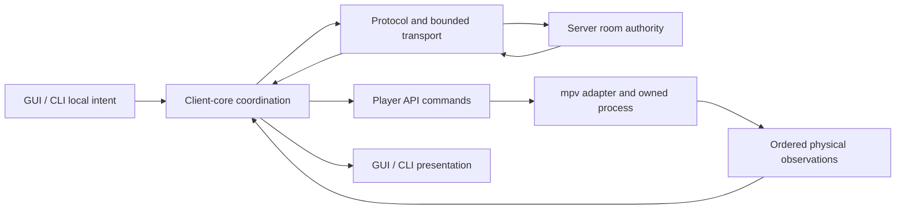

# Current architecture and verification

Generated from [coverage/current-architecture.toml](../coverage/current-architecture.toml). Update that catalog, then run `python scripts/architecture_index.py --write`.

Release 0.2.9; landed base `af226f1a6402c17d563c08cb7627af052c318254`; fixing commit **pending**; hosted evidence **pending**. The landed v0.2.8 main tree equals audit base 8b9ee43. v0.2.9 changes remain uncommitted; local results below describe their recorded implementation inputs, not a published release.

## Authority flow

Server state owns shared room order and canonical playback. Client-core maps that authority to ordered player commands and observations; it does not treat advisory status as playback authority. The mpv adapter owns physical process/IPC state. GUI and CLI own presentation and user intent. Settings transactions, network capacity, and evidence finalization have separate owners below.

## Crate responsibilities

| Crate | Responsibility |
|---|---|
| [sorotte-secret](../crates/sorotte-secret/Cargo.toml) | Typed sensitive values and redacted formatting. |
| [sorotte-protocol](../crates/sorotte-protocol/Cargo.toml) | Wire schemas, compatibility decoding, and encoded byte budgets. |
| [sorotte-core](../crates/sorotte-core/Cargo.toml) | Shared room and synchronization domain types. |
| [sorotte-lifecycle-evidence](../crates/sorotte-lifecycle-evidence/Cargo.toml) | Causal records, bounded serialization, and observable recorder failure. |
| [sorotte-server](../crates/sorotte-server/Cargo.toml) | Room authority, fanout, admission/byte permits, clocks, and durable server state. |
| [sorotte-media-match](../crates/sorotte-media-match/Cargo.toml) | Media identity/indexing and owned cancellable extraction processes. |
| [sorotte-client-core](../crates/sorotte-client-core/Cargo.toml) | Connection-scoped authority, ordered player observations, barriers, and local intent. |
| [sorotte-client-app](../crates/sorotte-client-app/Cargo.toml) | Shared application configuration, settings transactions, and presentation boundaries. |
| [sorotte-player-api](../crates/sorotte-player-api/Cargo.toml) | Player commands, physical observations, and lifecycle contracts. |
| [sorotte-player-mpv](../crates/sorotte-player-mpv/Cargo.toml) | mpv attachment, process containment, IPC recovery, and trusted Lua leases. |
| [sorotte-plex](../crates/sorotte-plex/Cargo.toml) | Credentialed Plex discovery, bounded requests, and logical media resolution. |
| [sorotte-cli](../crates/sorotte-cli/Cargo.toml) | CLI startup, session ownership, user commands, and bounded readers. |
| [sorotte-gui](../crates/sorotte-gui/Cargo.toml) | GUI intent/projection, worker ownership, native accessibility, and update staging. |
| [sorotte-sim](../crates/sorotte-sim/Cargo.toml) | Deterministic simulations and generated lifecycle histories. |
| [sorotte-compat](../crates/sorotte-compat/Cargo.toml) | Pinned independent Python interoperability and honest prerequisite accounting. |

## Current invariants and executable proof

Each local result identifies an implementation run. It is not a claim about a later modified candidate, another operating system, or hosted CI. Pending fixing commits stay explicit until a commit exists.

### Wire framing and room capacity (A02)

Every accepted shared state fits each recipient framing contract; over-budget changes are rejected before canonical state commits.

- Owners: [crates/sorotte-protocol/src/codec.rs](../crates/sorotte-protocol/src/codec.rs), [crates/sorotte-server/src/frame_limits.rs](../crates/sorotte-server/src/frame_limits.rs), [crates/sorotte-server/src/runtime_handlers.rs](../crates/sorotte-server/src/runtime_handlers.rs).
- Normative: [docs/SERVER_BOUNDARIES.md](../docs/SERVER_BOUNDARIES.md).
- Proof: [encoded_frame_budget_tracks_utf8_and_json_escaping_at_exact_boundary](../crates/sorotte-protocol/src/codec.rs); `cargo test --locked -p sorotte-protocol --lib encoded_frame_budget_tracks_utf8_and_json_escaping_at_exact_boundary`.
- Proof: [late_legacy_join_and_capability_downgrade_preserve_existing_sessions](../crates/sorotte-server/src/tests/frame_capacity_tests.rs); `cargo test --locked -p sorotte-server --lib late_legacy_join_and_capability_downgrade_preserve_existing_sessions`.
- Environment: Windows and Linux; Pinned live Python peer for interoperability.
- Capability: **implemented**. Local evidence: Whole-batch ControllerAuth, generated-room naming, and recipient byte-ceiling regressions passed. Windows pinned compatibility executed 145 tests with no skips; final report paths are in the implementation ledger.
- Remaining proof: For a future release, bind a committed fixing candidate and hosted evidence. This continuation is local and uncommitted.

### Server resource ownership (A10)

Admission happens before workers; encoded queued/in-flight bytes retain permits until completion or cleanup.

- Owners: [crates/sorotte-server/src/resources.rs](../crates/sorotte-server/src/resources.rs), [crates/sorotte-server/src/network.rs](../crates/sorotte-server/src/network.rs), [crates/sorotte-server/src/backpressure.rs](../crates/sorotte-server/src/backpressure.rs).
- Normative: [docs/SERVER_BOUNDARIES.md](../docs/SERVER_BOUNDARIES.md).
- Proof: [concurrent_byte_ownership_never_oversubscribes_and_releases_on_panic](../crates/sorotte-server/src/resources.rs); `cargo test --locked -p sorotte-server --lib concurrent_byte_ownership_never_oversubscribes_and_releases_on_panic`.
- Proof: [queued_bytes_follow_coalescing_write_ownership_and_receiver_drop](../crates/sorotte-server/src/network/resource_tests.rs); `cargo test --locked -p sorotte-server --lib queued_bytes_follow_coalescing_write_ownership_and_receiver_drop`.
- Catalogs: [server-resource-permits](../coverage/mutation-policy.toml).
- Environment: Windows and Linux loopback/process fixtures.
- Capability: **implemented**. Local evidence: Server suite passed 462 tests after framing/shutdown repairs. Final isolated resource campaign caught 41/41 viable mutants; two exact Default/E0277 unviable exceptions remain separately accounted.
- Remaining proof: For a future release, bind a committed fixing candidate and hosted evidence. This continuation is local and uncommitted.

### Local deadlines and issued ping identities (A08, A09)

Monotonic local time fences expiry; ping compensation accepts only a fresh once-consumed challenge issued to that connection.

- Owners: [crates/sorotte-server/src/local_clock.rs](../crates/sorotte-server/src/local_clock.rs), [crates/sorotte-server/src/runtime_maintenance.rs](../crates/sorotte-server/src/runtime_maintenance.rs).
- Normative: [docs/SERVER_BOUNDARIES.md](../docs/SERVER_BOUNDARIES.md).
- Proof: [matching_echo_uses_elapsed_time_across_wall_jumps_and_only_once](../crates/sorotte-server/src/tests/ping_timing_tests.rs); `cargo test --locked -p sorotte-server --lib matching_echo_uses_elapsed_time_across_wall_jumps_and_only_once`.
- Proof: [invalid_override_resumes_elapsed_time_without_poisoning_or_freezing_it](../crates/sorotte-server/src/local_clock.rs); `cargo test --locked -p sorotte-server --lib invalid_override_resumes_elapsed_time_without_poisoning_or_freezing_it`.
- Catalogs: [server-local-clock](../coverage/mutation-policy.toml).
- Environment: Windows and Linux; Independent wall/elapsed overrides; ordinary legacy ping echo scenario.
- Capability: **implemented**. Local evidence: Windows and Linux regression suites passed. Final isolated server-local-clock campaign caught 10/10 viable mutants; latency traces echo issued challenges.
- Remaining proof: For a future release, bind a committed fixing candidate and hosted evidence. This continuation is local and uncommitted.

### Private settings transactions (A03, A05, A06)

Duplicate INI keys share read/write semantics; pre-write private permissions and a cross-process transaction merge preserve current values and cleared credentials.

- Owners: [crates/sorotte-client-app/src/sorotte_ini.rs](../crates/sorotte-client-app/src/sorotte_ini.rs), [crates/sorotte-client-app/src/sorotte_ini/transaction.rs](../crates/sorotte-client-app/src/sorotte_ini/transaction.rs), [crates/sorotte-gui/src/app/runtime_owner/requests/pending_completions.rs](../crates/sorotte-gui/src/app/runtime_owner/requests/pending_completions.rs).
- Normative: [docs/design/settings-transactions.md](../docs/design/settings-transactions.md).
- Proof: [stale_full_snapshot_preserves_new_values_and_cannot_restore_cleared_secrets](../crates/sorotte-client-app/src/sorotte_ini/transaction_tests.rs); `cargo test --locked -p sorotte-client-app --lib stale_full_snapshot_preserves_new_values_and_cannot_restore_cleared_secrets`.
- Proof: [windows_new_file_and_empty_temporary_file_are_private_under_permissive_parent](../crates/sorotte-client-app/src/sorotte_ini/windows_tests.rs); `cargo test --locked -p sorotte-client-app --lib windows_new_file_and_empty_temporary_file_are_private_under_permissive_parent`.
- Catalogs: [settings-duplicate-keys](../coverage/mutation-policy.toml).
- Environment: Windows protected DACL tests; Windows and Linux transaction/process tests.
- Capability: **implemented**. Local evidence: Windows protected-DACL and process transaction suites and Linux owner/mode/process suites passed. Final isolated duplicate-key campaign caught 12/12 viable mutants; two exact let-chain unviable exceptions remain separate.
- Remaining proof: For a future release, bind a committed fixing candidate and hosted evidence. This continuation is local and uncommitted.

### Owned player shutdown (A04)

A blocked player worker cannot outlive independent owned-process cleanup; externally attached players never enter the ownership scope.

- Owners: [crates/sorotte-player-mpv/src/managed_process.rs](../crates/sorotte-player-mpv/src/managed_process.rs), [crates/sorotte-gui/src/app/runtime_queue.rs](../crates/sorotte-gui/src/app/runtime_queue.rs).
- Normative: [crates/sorotte-player-mpv/src/managed_process.rs](../crates/sorotte-player-mpv/src/managed_process.rs).
- Proof: [gui_blocked_owner_parent_exit_terminates_owned_player_and_preserves_external_player](../crates/sorotte-gui/src/app/runtime_queue/tests/process_shutdown.rs); `cargo test --locked -p sorotte-gui --lib --features gui-semantic-smoke gui_blocked_owner_parent_exit_terminates_owned_player_and_preserves_external_player`.
- Environment: Windows job containment; Linux process containment; Disposable owned and external process fixtures.
- Capability: **implemented**. Local evidence: Windows and Linux abrupt-parent and blocked-owner subprocess fixtures passed, preserving externally attached player processes. Required native Exit lifecycle evidence also passed.
- Remaining proof: For a future release, bind a committed fixing candidate and hosted evidence. This continuation is local and uncommitted.

### Media extraction cancellation (A07)

Cancellation precedes filesystem/probe work, spans every tool and pipe drain, and reaps the owned process tree under one deadline.

- Owners: [crates/sorotte-media-match/src/extraction.rs](../crates/sorotte-media-match/src/extraction.rs), [crates/sorotte-media-match/src/extraction/process.rs](../crates/sorotte-media-match/src/extraction/process.rs).
- Normative: [crates/sorotte-media-match/src/extraction.rs](../crates/sorotte-media-match/src/extraction.rs), [crates/sorotte-media-match/src/extraction/process.rs](../crates/sorotte-media-match/src/extraction/process.rs).
- Proof: [cancellation_reaps_descendant_that_holds_an_exited_childs_pipes](../crates/sorotte-media-match/src/extraction/process/tests.rs); `cargo test --locked -p sorotte-media-match --lib cancellation_reaps_descendant_that_holds_an_exited_childs_pipes`.
- Environment: Windows and Linux disposable tool/process fixtures.
- Capability: **implemented**. Local evidence: Windows adversarial process fixtures and final Linux cancellation/descendant/pipe fixtures passed. The final Linux generated-media integration passed with real ffmpeg/ffprobe.
- Remaining proof: For a future release, bind a committed fixing candidate and hosted evidence. This continuation is local and uncommitted.

### Credentialed HTTP origins and budgets (A01, A15)

Plex retains credentials only within the canonical origin and bounds metadata bytes plus aggregate multi-request work.

- Owners: [crates/sorotte-plex/src/http.rs](../crates/sorotte-plex/src/http.rs), [crates/sorotte-plex/src/library.rs](../crates/sorotte-plex/src/library.rs), [crates/sorotte-plex/src/discovery.rs](../crates/sorotte-plex/src/discovery.rs).
- Normative: [docs/HTTP_INGRESS_LIMITS.md](../docs/HTTP_INGRESS_LIMITS.md).
- Proof: [every_credentialed_operation_rejects_cross_origin_redirects](../crates/sorotte-plex/src/tests/http_boundaries.rs); `cargo test --locked -p sorotte-plex --lib every_credentialed_operation_rejects_cross_origin_redirects`.
- Proof: [search_body_budget_is_shared_across_individually_valid_responses](../crates/sorotte-plex/src/tests/http_boundaries.rs); `cargo test --locked -p sorotte-plex --lib search_body_budget_is_shared_across_individually_valid_responses`.
- Catalogs: [plex-http-origin](../coverage/mutation-policy.toml).
- Environment: Windows and Linux loopback HTTP/TLS.
- Capability: **implemented**. Local evidence: Windows and Linux loopback origin/body/search tests passed. Final isolated Plex origin campaign caught 10/10 viable mutants.
- Remaining proof: For a future release, bind a committed fixing candidate and hosted evidence. This continuation is local and uncommitted.

### Private update staging (A15)

Update metadata, archives, and downloads have separate quotas; a protected stage remains owned until validated updater handoff.

- Owners: [crates/sorotte-gui/src/update_limits.rs](../crates/sorotte-gui/src/update_limits.rs), [crates/sorotte-gui/src/app/remote_services/download.rs](../crates/sorotte-gui/src/app/remote_services/download.rs).
- Normative: [docs/HTTP_INGRESS_LIMITS.md](../docs/HTTP_INGRESS_LIMITS.md).
- Proof: [quota_failure_cleans_only_its_stage_and_retains_install_and_rollback](../crates/sorotte-gui/src/app/remote_services/ingress_tests.rs); `cargo test --locked -p sorotte-gui --lib --features gui-semantic-smoke quota_failure_cleans_only_its_stage_and_retains_install_and_rollback`.
- Environment: Windows updater replacement integration; Cross-platform ZIP and loopback unit fixtures.
- Capability: **implemented**. Local evidence: Quota/staging and recovery tests passed. The actual local development GUI archive passed independent inventory, launch, updater success, and rollback verification.
- Remaining proof: For a future release, bind a committed fixing candidate and hosted evidence. This continuation is local and uncommitted.

### Trusted executable Lua leases (A13)

Executable resources require a private trusted cache and handles retained across the materialize-to-load seam; corrupt or untrusted paths fail or repair under ownership.

- Owners: [crates/sorotte-player-mpv/src/bridge_resource.rs](../crates/sorotte-player-mpv/src/bridge_resource.rs), [crates/sorotte-player-mpv/src/adapter/bridge_settings.rs](../crates/sorotte-player-mpv/src/adapter/bridge_settings.rs), [crates/sorotte-player-mpv/src/adapter/network_options.rs](../crates/sorotte-player-mpv/src/adapter/network_options.rs).
- Normative: [crates/sorotte-player-mpv/src/bridge_resource.rs](../crates/sorotte-player-mpv/src/bridge_resource.rs), [crates/sorotte-player-mpv/src/bridge_resource/windows.rs](../crates/sorotte-player-mpv/src/bridge_resource/windows.rs), [crates/sorotte-player-mpv/src/bridge_resource/unix.rs](../crates/sorotte-player-mpv/src/bridge_resource/unix.rs).
- Proof: [materialize_to_load_seam_cannot_redirect_through_replaced_ancestor](../crates/sorotte-player-mpv/src/bridge_resource/security_tests.rs); `cargo test --locked -p sorotte-player-mpv --lib materialize_to_load_seam_cannot_redirect_through_replaced_ancestor`.
- Proof: [core_hook_keeps_network_option_writes_inside_mpv_and_classifies_a_to_b_as_superseded](../crates/sorotte-player-mpv/src/tests/ipc_tests.rs); `cargo test --locked -p sorotte-player-mpv --lib core_hook_keeps_network_option_writes_inside_mpv_and_classifies_a_to_b_as_superseded`.
- Environment: Windows protected directory handles; Linux owner/mode/reparse boundaries; Concurrent disposable cache fixtures.
- Capability: **implemented**. Local evidence: Windows trust/race tests and real mpv passed. Linux concurrent repair and delayed-open transport regressions, supported real-mpv bridge lifecycle, and cache-cap integration passed after retaining the network-hook lease through acknowledgement.
- Remaining proof: For a future release, bind a committed fixing candidate and hosted evidence. This continuation is local and uncommitted.

### Player retry and physical recovery (A14)

A failed initialization completes before its full reconnect delay begins; recovery keeps attachment and media identities explicit.

- Owners: [crates/sorotte-player-mpv/src/adapter/reconnection.rs](../crates/sorotte-player-mpv/src/adapter/reconnection.rs), [crates/sorotte-player-mpv/src/adapter/stream_recovery.rs](../crates/sorotte-player-mpv/src/adapter/stream_recovery.rs).
- Normative: [crates/sorotte-player-mpv/src/adapter/reconnection.rs](../crates/sorotte-player-mpv/src/adapter/reconnection.rs), [docs/STREAM_SYNCHRONIZATION.md](../docs/STREAM_SYNCHRONIZATION.md).
- Proof: [explicit_json_ipc_retry_waits_a_full_interval_after_slow_version_failure](../crates/sorotte-player-mpv/src/adapter/version_policy_tests.rs); `cargo test --locked -p sorotte-player-mpv --lib explicit_json_ipc_retry_waits_a_full_interval_after_slow_version_failure`.
- Proof: [real_mpv_bridge_lifecycle_over_json_ipc](../crates/sorotte-player-mpv/src/tests/smoke_tests.rs); `cargo test --locked -p sorotte-player-mpv --lib -- --ignored real_mpv_bridge_lifecycle_over_json_ipc`.
- Catalogs: [player-mpv-explicit-ipc-retry](../coverage/mutation-policy.toml).
- Environment: Scripted slow-initialization clock; Installed supported mpv and generated media for real-player proof.
- Capability: **implemented**. Local evidence: Slow-initialization retry tests passed. Supported real mpv passed on Windows and Linux; all four Linux playback/recovery contracts passed. Final isolated retry campaign caught 11/11 viable mutants, with two reviewed unviable cases.
- Remaining proof: For a future release, bind a committed fixing candidate and hosted evidence. This continuation is local and uncommitted.

### Ordered client ownership (A19)

Ordered physical observations, participant advisory state, barriers, and local intent remain separate owned states after extraction.

- Owners: [crates/sorotte-client-core/src/runtime/playback_coordination/ordered_events.rs](../crates/sorotte-client-core/src/runtime/playback_coordination/ordered_events.rs), [crates/sorotte-client-core/src/runtime/playback_coordination/participant_status.rs](../crates/sorotte-client-core/src/runtime/playback_coordination/participant_status.rs), [crates/sorotte-client-core/src/runtime/playback_coordination/barrier.rs](../crates/sorotte-client-core/src/runtime/playback_coordination/barrier.rs), [crates/sorotte-client-core/src/runtime/playback_coordination/local_intent.rs](../crates/sorotte-client-core/src/runtime/playback_coordination/local_intent.rs).
- Normative: [docs/PLAYBACK_LIFECYCLE_ASSURANCE.md](../docs/PLAYBACK_LIFECYCLE_ASSURANCE.md), [crates/sorotte-client-core/src/runtime/playback_coordination.rs](../crates/sorotte-client-core/src/runtime/playback_coordination.rs).
- Proof: [ordered_state_sync_never_pairs_new_revision_with_pre_effect_player_sample](../crates/sorotte-client-core/src/runtime/playback_coordination/tests.rs); `cargo test --locked -p sorotte-client-core --lib ordered_state_sync_never_pairs_new_revision_with_pre_effect_player_sample`.
- Catalogs: [LIFE-AUTH-001](../coverage/playback-lifecycle.toml), [client-participant-status-runtime](../coverage/mutation-policy.toml).
- Environment: Windows and Linux unit/generated-history suites; Adapter-to-consumer and real-player seams.
- Capability: **implemented**. Local evidence: Windows client-core suite passed 861 tests plus integration tests; final Linux all-feature workspace and real-player recovery suites passed. Source/test identities remain stable after extraction.
- Remaining proof: For a future release, bind a committed fixing candidate and hosted evidence. This continuation is local and uncommitted.

### Sticky evidence finalization (A11)

Ignored producer failures remain observable at finalization; invalid or partially serialized records cannot produce a successful evidence claim.

- Owners: [crates/sorotte-lifecycle-evidence/src/lib.rs](../crates/sorotte-lifecycle-evidence/src/lib.rs).
- Normative: [docs/VERIFICATION_INPUTS.md](../docs/VERIFICATION_INPUTS.md).
- Proof: [concurrent_emitters_observe_one_sticky_failure_without_further_writes](../crates/sorotte-lifecycle-evidence/src/failure_tests.rs); `cargo test --locked -p sorotte-lifecycle-evidence --lib concurrent_emitters_observe_one_sticky_failure_without_further_writes`.
- Proof: [product_writer_faults_reach_the_python_lifecycle_consumer](../crates/sorotte-lifecycle-evidence/src/failure_tests.rs); `cargo test --locked -p sorotte-lifecycle-evidence --lib product_writer_faults_reach_the_python_lifecycle_consumer`.
- Environment: Windows and Linux; Python for actual Rust-producer-to-consumer fault proof.
- Capability: **implemented**. Local evidence: Sticky validation/I/O/privacy/concurrency and Rust-to-Python fault cases passed. All 15 public crates passed the 0.2.8 semver comparison after RecordingFailure was carried through the existing Io variant.
- Remaining proof: For a future release, bind a committed fixing candidate and hosted evidence. This continuation is local and uncommitted.

### Strict verification input boundaries (A12)

Actual input reads, JSON records, and integer domains are bounded and strict before independent artifact oracles attest results.

- Owners: [scripts/artifact_input.py](../scripts/artifact_input.py), [scripts/mutation_ci.py](../scripts/mutation_ci.py), [scripts/playback_lifecycle_oracle.py](../scripts/playback_lifecycle_oracle.py).
- Normative: [docs/VERIFICATION_INPUTS.md](../docs/VERIFICATION_INPUTS.md).
- Proof: [test_mutation_cli_rejects_matrix_before_source_and_proof_attestation](../scripts/tests/test_artifact_entrypoints.py); `python -m unittest scripts.tests.test_artifact_entrypoints`.
- Proof: [test_package_verifier_clis_reject_manifest_matrix_after_archive_hash_verification](../scripts/tests/test_artifact_entrypoints.py); `python -m unittest scripts.tests.test_artifact_entrypoints`.
- Environment: Python 3.11 through 3.13; Windows process-wrapper tests require fixture process rights.
- Capability: **implemented**. Local evidence: Full Python discovery passed 751 tests. The final 47-test mutation runner suite additionally verifies bundled Lua resource changes invalidate a report; no malformed input is accepted as a producer status.
- Remaining proof: For a future release, bind a committed fixing candidate and hosted evidence. This continuation is local and uncommitted.

### Critical coverage and mutation policy (A16)

Module extraction cannot silently demote critical responsibility, and immutable base/head selection cannot omit a required mutation report.

- Owners: [scripts/critical_boundaries.py](../scripts/critical_boundaries.py), [scripts/mutation_selection.py](../scripts/mutation_selection.py), [scripts/mutation_ci.py](../scripts/mutation_ci.py).
- Normative: [docs/design/verification-policy.md](../docs/design/verification-policy.md).
- Proof: [test_extracted_critical_module_cannot_become_ordinary](../scripts/tests/test_critical_boundaries.py); `python -m unittest scripts.tests.test_critical_boundaries`.
- Proof: [test_omitted_or_duplicate_selected_report_is_never_accepted](../scripts/tests/test_mutation_selection.py); `python -m unittest scripts.tests.test_mutation_selection`.
- Catalogs: [client-runtime-1](../coverage/critical-boundaries.toml).
- Environment: Python policy fixtures; Pinned cargo-mutants 27.1.0 with independent target/build directories per worker.
- Capability: **implemented**. Local evidence: Critical inventory follows 87 production modules across 10 responsibilities. Final campaigns use independent worker targets and bind Rust, fixtures, bundled resources, manifests, and verification scripts; accepted counts are in the implementation ledger.
- Remaining proof: For a future release, bind a committed fixing candidate and hosted evidence. This continuation is local and uncommitted.

### Dependency and archive provenance (A17)

Pinned scans record exact advisory evidence or fail unavailable; archive inventories bind resolved build inputs and actual payload hashes without replacing container signing.

- Owners: [scripts/dependency_policy.py](../scripts/dependency_policy.py), [deny.toml](../deny.toml), [scripts/package-gui-release.ps1](../scripts/package-gui-release.ps1), [scripts/package-server-release.ps1](../scripts/package-server-release.ps1).
- Normative: [docs/design/verification-policy.md](../docs/design/verification-policy.md).
- Proof: [test_known_advisory_fixture_fails_even_with_valid_scanner_summary](../scripts/tests/test_dependency_policy.py); `python -m unittest scripts.tests.test_dependency_policy`.
- Proof: [test_unapproved_source_and_duplicate_package_are_detected](../scripts/tests/test_dependency_policy.py); `python -m unittest scripts.tests.test_dependency_policy`.
- Environment: Online RustSec and PyPI metadata; Pinned cargo-deny 0.20.2 and pip-audit 2.10.1; Windows/Linux package target.
- Capability: **implemented**. Local evidence: Live Rust and Python scans passed without exceptions; target/verification/dependencies-resumed/report.json retains advisory/scanner inputs. Actual local GUI/server development archives passed independent payload inventory and runtime verification.
- Remaining proof: Refresh advisories when releasing; committed provenance, public assets, signing, and container publication are outside this local continuation. External native tools retain separate identities.

### Reproducible scaling measurements (A18)

Normal/large workloads and bounded churn report input identity, allocations, resource retention, and latency distributions against a named comparable baseline.

- Owners: [crates/sorotte-gui/examples/scaling_workloads.rs](../crates/sorotte-gui/examples/scaling_workloads.rs), [scripts/scaling_workloads.py](../scripts/scaling_workloads.py), [crates/sorotte-gui/src/app/semantic_driver/scaling.rs](../crates/sorotte-gui/src/app/semantic_driver/scaling.rs).
- Normative: [docs/SCALING_WORKLOADS.md](../docs/SCALING_WORKLOADS.md).
- Proof: [test_independent_resource_checks_reject_false_success_labels](../scripts/tests/test_scaling_workloads.py); `python -m unittest scripts.tests.test_scaling_workloads`.
- Environment: Windows and Linux headless native build prerequisites; Stable worker for timing trends; Separate candidate startup benchmark.
- Capability: **implemented**. Local evidence: Final fixture-v2 baseline/candidate comparisons passed on Windows and Linux, including clone sensitivity and bounded churn. Optimized GUI startup measured five samples in each of three scenarios; timings are advisory on this shared host.
- Remaining proof: Establish dedicated-runner timing noise before introducing p95 thresholds; these shared-host comparisons are advisory. Committed release identity remains a future obligation.

### Native GUI display and accessibility (A21)

Measured native DPI, app zoom, long-content reachability, validation labels, and keyboard focus remain distinct assertions.

- Owners: [crates/sorotte-gui/src/bin/sorotte-gui-native-smoke/visual_artifacts/display_matrix.rs](../crates/sorotte-gui/src/bin/sorotte-gui-native-smoke/visual_artifacts/display_matrix.rs), [scripts/gui-display-matrix.ps1](../scripts/gui-display-matrix.ps1).
- Normative: [docs/GUI_DISPLAY_MATRIX.md](../docs/GUI_DISPLAY_MATRIX.md).
- Proof: [display_options_reject_invalid_values_and_wrong_native_dpi](../crates/sorotte-gui/src/bin/sorotte-gui-native-smoke/visual_artifacts/display_matrix.rs); `cargo test --locked -p sorotte-gui --bin sorotte-gui-native-smoke --features gui-native-smoke display_options_reject_invalid_values_and_wrong_native_dpi`.
- Proof: [long_participant_names_keep_full_accessible_text_inside_narrow_rows](../crates/sorotte-gui/src/app/render_egui/tests/action_mapping_surface.rs); `cargo test --locked -p sorotte-gui --lib long_participant_names_keep_full_accessible_text_inside_narrow_rows`.
- Proof: [narrow_playlist_rows_paint_a_readable_title_beside_compact_actions](../crates/sorotte-gui/src/app/render_egui/tests/playlist_interactions.rs); `cargo test --locked -p sorotte-gui --lib narrow_playlist_rows_paint_a_readable_title_beside_compact_actions`.
- Environment: Windows interactive desktop and native UIA; Separate measured 96, 144, 192 DPI profiles; Explicit authorization for physical input on an active desktop.
- Capability: **implemented**. Local evidence: All six 144-DPI StrictPhysical display cases passed, and the 10-scenario native workflow plus 25 menu-input cycles passed. Visual review confirmed theme selection and compact title geometry; default CJK glyph fallback remains an explicit environment limit.
- Remaining proof: Native 96/192 DPI and actual screen-reader interaction require separate environments; 144 DPI and app zoom do not attest them. Default fonts show placeholder glyphs for the fixture's CJK character.

### Bounded persistence shutdown (A22)

SQLite contention shares a bounded flush/join budget without blocking the async runtime or claiming durability after a failed flush.

- Owners: [crates/sorotte-server/src/persistence_actor.rs](../crates/sorotte-server/src/persistence_actor.rs), [crates/sorotte-server/src/persistence_actor/shutdown.rs](../crates/sorotte-server/src/persistence_actor/shutdown.rs).
- Normative: [docs/SERVER_BOUNDARIES.md](../docs/SERVER_BOUNDARIES.md).
- Proof: [persistence_shutdown_held_lock_subprocess_finishes_without_durability_claim](../crates/sorotte-server/src/tests/network_tests.rs); `cargo test --locked -p sorotte-server --lib persistence_shutdown_held_lock_subprocess_finishes_without_durability_claim`.
- Proof: [persistence_shutdown_includes_preceding_flush_in_total_budget](../crates/sorotte-server/src/tests/network_tests.rs); `cargo test --locked -p sorotte-server --lib persistence_shutdown_includes_preceding_flush_in_total_budget`.
- Environment: Windows and Linux SQLite/process fixtures.
- Capability: **implemented**. Local evidence: Windows and Linux held-lock subprocesses and the preceding-flush/full-actor-queue regressions passed. A 200 ms shutdown deadline covers already queued work; timed-out cleanup ownership remains observable.
- Remaining proof: For a future release, bind a committed fixing candidate and hosted evidence. This continuation is local and uncommitted.

### Current ownership and proof map (A20)

Every scoped audit task maps to source ownership, a normative contract, an executable proof, required environment, and explicitly limited evidence.

- Owners: [scripts/architecture_index.py](../scripts/architecture_index.py), [coverage/current-architecture.toml](../coverage/current-architecture.toml).
- Normative: [docs/CURRENT_ARCHITECTURE.md](../docs/CURRENT_ARCHITECTURE.md).
- Proof: [test_representative_boundaries_have_live_source_and_executable_proof](../scripts/tests/test_architecture_index.py); `python -m unittest scripts.tests.test_architecture_index`.
- Environment: Python 3.11 or newer; No hosted environment required for static reference validation.
- Capability: **implemented**. Local evidence: The index maps every A01-A22 task to current source/proof/environment ownership; CLI write/check coverage handles LF and CRLF checkouts. The implementation ledger records current working-tree evidence and superseded runs separately from future release provenance.
- Remaining proof: For a future release, bind a committed fixing candidate and hosted evidence. This continuation is local and uncommitted.

## Historical material

The chronological [coverage findings](../docs/TEST_COVERAGE_FINDINGS.md), [coverage strategy](../docs/TEST_COVERAGE_STRATEGY.md), and [coverage ledger](../coverage/README.md) retain earlier decisions and evidence. Their old counts and remaining-work notes describe their recorded revisions. Use this current map and [DEVELOPMENT](../docs/DEVELOPMENT.md) to locate today's owner and required execution command.
