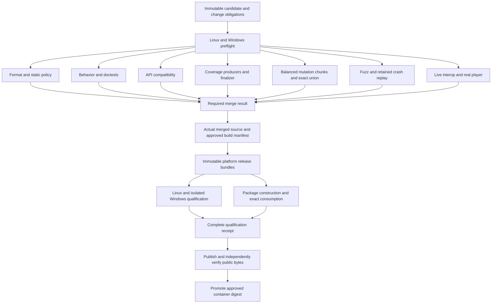

# Testing apparatus audit and improvement plan

Audited 6 September 2026. Baseline: `4000eca69b52003b66e81b6998d15c555e7eb6d1`, fetched from `origin/main` and independently checked against the GitHub branch and `v0.2.9` tag. Worktree: `tmp/testing-apparatus-audit-2026-09-06`; branch: `codex/testing-apparatus-audit-2026-09-06`. This is an audit and implementation plan; no product code, test policy, repository settings, or publication state was changed.

## Assessment

Keep the testing depth. Improve the machinery that selects, prepares, executes, explains, and reuses the checks. The 0.2.9 record contains real product regressions, assertion gaps discovered by mutation, incorrect harness behavior, environment failures, and redundant execution. Those categories need different remedies.

The largest measured cost was mutation testing, not native input or fuzzing. On the last PR candidate, one mutation shard took **66m45s**, and its workflow took **76m22s**. The principal Linux CI job took **25m39s**, including **13m31s** for public API comparison. Five release consumers subsequently ran separate Windows/Linux lifecycle qualifications at the same merge SHA. There is also a control gap: **GitHub currently reports `main` as unprotected, and the applicable rules endpoint returns an empty list**. The careful 0.2.9 merge sequence depended on operator discipline.

Start with T01–T04, T08–T12: enforce merge requirements, make preflight and diagnostics cheap, rebalance mutation execution, and remove the need to repair or operate the Windows environment during qualification. Then consolidate release qualification around actual artifact identities. Do not begin by lowering thresholds or making valuable checks optional.

## Evidence and scope

The audit combines the current workflow graph and producer/consumer code, the [0.2.9 implementation ledger](v0.2.9-implementation.md), retained release closure records, live GitHub PR/run/job/step metadata, selected original job logs, and fresh harness self-tests. Historical failures are not presented as still-unfixed product bugs. Recommendations that have not been exercised are explicitly proposals.

The [evidence packet](2026-09-06-testing-evidence/README.md) contains reproducible collectors, a compact hosted summary, workflow inventory, policy validation, source anchors, and local validation results. Raw API responses and logs remain under `target/testing-audit/`. The source and tag match the prior agent's closure; its tested PR head `9ced745e5aae40c782b7ef110c5434db3c9b6a6e` and the merge have the same Git tree, `e57689b86eb9d323e34bc70df255790664ef7c7d`. This does **not** establish binary identity across their builds.

Reviewed surfaces include all 10 repository workflows; Rust workspace/default/all-feature/doctest execution; nextest retry/leak policy; Python harness contracts; behavior and ignored-test registries; changed-line and platform coverage; mutation selection/execution/finalization; fuzzing and corpus retention; deterministic lifecycle models and real-player system walks; live Python interoperability; native GUI, display and startup harnesses; scaling and privileged persistence harness boundaries; package/container verification; dependency inputs; evidence identity, retention, and release orchestration.

Fresh execution:

- **767 Python harness/policy tests passed in 48.800 seconds** on Windows with Python 3.13.5 and normal process/temp permissions. Hosted CI uses Python 3.11; this local result is additional evidence, not proof of reproducing its exact environment.
- Eight current catalog/policy/model commands passed: 10 responsibilities / 87 critical modules; architecture references; 23 behaviors / 99 proofs / two evidence lanes; all 27 ignored-test declarations; empty known-defect registry; 24 mutation shards / 71 reviewed unviable policy entries; the closed lifecycle model; and retained lifecycle seed replay.
- The model contains 11 machines, 77 states, 78 transitions and 15 invariants, with eight declared gaps closed. The seed suite covers 56 transitions; it is not the 75-transition composed system qualification.
- The first restricted self-test run passed 764/767. One process-kill assertion reported access denied, one environment-forwarding assertion saw empty output, and the semver test rejected the auditor's repository-local TEMP override. All passed unchanged in the normal environment. The TEMP error was caused by this audit's setup; these are not three new product defects.

No new full Rust build, LLVM coverage campaign, mutation campaign, live mpv run, physical GUI interaction, Sandbox provisioning, privileged disk-fault test, or release was performed. Existing hosted runs supply those historical observations. This audit covers the apparatus and its recorded operation; it does not newly qualify 0.2.9 or prove every future test schedule reliable.

## What the run history says

The measured cohort is PR #32's 14 commits plus its merge SHA, restricted to repository-owned workflows in the 4–6 September API window. Twelve PR heads had runs; two intermediate commits were not separate tested candidates. PR creation to merge was **7h33m20s**, excluding earlier local implementation and testing.

| Observation | Measured value | Interpretation |
|---|---:|---|
| Repository workflow runs | 77: 49 success, 11 failure, 17 cancelled | A run conclusion is not a defect classification. A cancelled run can contain successful and failed jobs. |
| Attempt responses | 83 | Includes unchanged retries. |
| Distinct job executions or skips | 701 | Removed 17 carried-forward job records; excluded three Dependabot runs. |
| Sum of observed job execution | 4,772.37 minutes | Includes parallel and self-hosted work; this is neither billed CPU time nor developer time. |
| Mutation jobs | 2,903.72 minutes, 60.8% of observed execution | The first performance target. |
| Mutation jobs concluding cancelled | 690.48 minutes | Useful measure of interrupted work; not all of it is recoverable or wasted. |
| Final candidate mutation workflow | 76m22s | [Run 33958176599](https://github.com/ropbet-radbyt/sorotte/actions/runs/33958176599). |
| Final candidate CI workflow | 26m31s | [Run 33958176605](https://github.com/ropbet-radbyt/sorotte/actions/runs/33958176605). |
| Final candidate server-release workflow | 37m41s | Includes a fresh lifecycle qualification before packaging. [Run 33958174534](https://github.com/ropbet-radbyt/sorotte/actions/runs/33958174534). |
| Merge-SHA lifecycle producers | Five Linux + five Windows executions; 85.82 job-minutes | Main GUI publication, stable GUI, server archives, container publication, and later container promotion. |

GitHub gives carried successful jobs new IDs in later attempt responses while retaining their original timestamps. Counting IDs alone overstates execution. The collector preserves raw responses; the analyzer deduplicates by run, job name, execution timestamps, and conclusion. No billed-cost estimate or general flake rate is inferred from this single release.

The final server-status mutation shard tested **216 mutants: 200 caught, 16 compiler-unviable**, with an unmutated baseline. Those are assertion-sensitivity results, not 200 real bugs. Its policy runs the complete server library test inventory with two mutation workers. The finalizer then spent another 309 seconds verifying all selected reports, including fresh test-inventory builds. [Shard policy](https://github.com/ropbet-radbyt/sorotte/blob/4000eca69b52003b66e81b6998d15c555e7eb6d1/coverage/mutation-policy.toml#L149), [job](https://github.com/ropbet-radbyt/sorotte/actions/runs/33958176599/job/101285310824).

The unchanged Windows release retry is narrower than “packaging was flaky.” The original log failed during the verifier's **duplicate workspace test pass**, at `ProtocolClient::read_message`, with Windows error 10060. The first failure poisoned the shared release-test mutex, so two later cases failed before exercising their behavior. The focused retry passed. The origin of the initial socket timeout remains unknown. [Original job](https://github.com/ropbet-radbyt/sorotte/actions/runs/33961659708/job/101298141300), [read boundary](https://github.com/ropbet-radbyt/sorotte/blob/4000eca69b52003b66e81b6998d15c555e7eb6d1/crates/sorotte-server/tests/support/mod.rs#L365).

## Coverage and assurance to preserve

| Layer | Existing value | Apparatus issue / plan |
|---|---|---|
| Rust unit, property, integration and doctests | Broad cross-platform behavior; generated schedules; focused server/settings/process regressions | Improve early feedback and capability setup, not raw test-count targets. T02, T11–T14. |
| nextest | Diagnostic retry still fails flaky tests; leaked processes fail; attempt output retained | Preserve these semantics. Add useful per-test deadlines and classification where appropriate. T04, T11. |
| Behavior, architecture, critical and ignored registries | Exact symbols, owners, no-empty parent selections, base/head policy protections | Registry updates should be deliberate and easier to produce. T05, T18. |
| Coverage | Independent 80% ordinary / 90% critical changed-line policy; Linux/Windows map union; source-bound physical lines | Detect instrumentation and inventory breakage before full collection. T06. |
| Mutation | Immutable base/head selection union, isolated targets, complete report sets, zero misses/timeouts, reviewed exact unviables | Split large inventories and reduce aggregation build cost. T03. |
| Fuzzing | Three ASan targets, pinned nightly/tool, bounded PR execution, retained concrete crashes | Keep required relevant-PR fuzzing and permanent crash replay. T16. |
| Lifecycle model and real mpv | Independent model, causal ownership, minimum/newest player endpoints, terminal/recovery system walks | Preserve crossed boundaries; fix fixture contracts and qualification orchestration. T07, T10. |
| Live legacy interop | Actual pinned reference, zero-skip required lane, explicit capture fixtures | Unify the older standalone server verifier's input contract. T13–T14. |
| Native GUI and display | Real input/accessibility, strict physical inventory, actual recovery and second-client composition | Reproducible isolated runner, complete failure artifacts, scheduled display ownership. T08–T09, T15. |
| Scaling, startup and persistence faults | Named comparable fixtures, resource invariants, optimized startup separation, owned privileged replay | These exist; several have no routine workflow invocation. T15. |
| Packages and containers | Actual archive consumption, updater success/rollback, digest inventories, public container verification/signatures | Bind lifecycle to the bytes shipped and promote approved bytes. T07, T14. |
| Dependency checks | Recorded RustSec identity, bounded Python advisory evidence, native-component inventory | Preserve freshness and make release prerequisites explicit. T13. |

The apparatus is substantial software: 33 top-level Python scripts (37,128 lines), 45 Python test files (27,180 lines), 19 PowerShell scripts (5,405 lines), 12 policy TOMLs (6,010 lines), and 3,504 workflow lines. These counts exclude Rust tests and native Rust drivers. There are already meaningful self-tests and some lane-specific preflights; “add tests for the test harness” alone is not a sufficient plan.

## Action plan

Evidence labels: **Observed** means freshly executed or directly present in retained hosted output. **Source-backed** means the current code/graph establishes the issue, without a new live reproduction. Effort estimates are implementation working days, including focused validation; they are planning ranges, not commitments. Owners are suggested responsibilities, not assignments to named people.

### T01 — Make the merge requirements enforceable

**P0 · Observed · repository administration + CI · 1–2 days · dependencies: none.**

The current branch endpoint says `protected:false`; classic protection returns “Branch not protected,” and applicable rules are `[]`. Preserve this snapshot in the evidence packet. The 0.2.9 gates were run, but their existence did not mechanically require a future author to wait.

Define stable aggregate results for behavior/coverage, selected mutation, fuzz, dependency and package obligations, then apply required checks and appropriate force-push/deletion restrictions. Handle documentation-only and zero-selected-shard cases with a successful, validated “no applicable work” receipt. Requiring today's path-filtered fuzz workflow or conditionally absent mutation finalizer directly would strand such PRs. Native checks must use trusted candidate authorization and isolated runners; never expose a privileged self-hosted runner to arbitrary PR code.

**Acceptance:** a disposable PR cannot merge with a failed, pending, cancelled, missing or wrong-revision required receipt; a docs-only PR completes its aggregates; direct mutation of protected `main` is rejected under the agreed bypass policy. Verify settings through the API, not screenshots or workflow YAML alone. This task includes an explicit repository-settings change during implementation, not during this audit.

### T02 — Add one supported local and CI preflight entrypoint

**P1 · Observed + source-backed · verification tooling · 2–3 days · dependencies: none.**

Current catalog self-tests run in the Linux contract job while other expensive jobs start independently. Windows-only process-wrapper behavior does not receive the same full Python discovery in ordinary PR CI. Local execution also depends on temp location, process permissions, Python packages, Git trust, and installed tools. [Current self-test step](https://github.com/ropbet-radbyt/sorotte/blob/4000eca69b52003b66e81b6998d15c555e7eb6d1/.github/workflows/rust-ci.yml#L98).

Provide a documented `verify preflight` / `verify plan` entrypoint backed by the existing validators. Detect pinned tool versions, required Python imports, immutable legacy revision, external temp-path requirements, target isolation, process-control capability, media tools and required native session properties. Run cheap schema/policy checks on Linux and Windows before relevant expensive work. Keep compile-dependent inventory discovery as a separate preparation stage; do not describe it as a seconds-long static check.

**Acceptance:** stale paths, missing tools, wrong legacy SHA, shared mutation targets, unsupported process control and invalid semver temp layout produce distinct actionable failures before campaigns begin. Preflight does not launch physical GUI interactions, alter global Git trust, or silently downgrade required work. Record preflight duration and a replay command. Target under two minutes for the non-compiling stage on provisioned workers.

### T03 — Repartition mutation work and remove repeated inventory builds

**P1 · Observed · mutation infrastructure + server owners · 3–5 days · dependencies: T02.**

The 216-mutant server-status shard dominates the final candidate. Other long shards include CLI framing (25m08s), GUI playlist delivery (20m23s), and client status runtime (17m56s). The report finalizer recompiles inventories via `verify_report`, and the fixed ten-shard report set repeats checks after selected-shard verification. [Inventory revalidation](https://github.com/ropbet-radbyt/sorotte/blob/4000eca69b52003b66e81b6998d15c555e7eb6d1/scripts/mutation_ci.py#L1944), [aggregate workflow](https://github.com/ropbet-radbyt/sorotte/blob/4000eca69b52003b66e81b6998d15c555e7eb6d1/.github/workflows/rust-mutation.yml#L147).

Partition the immutable mutant inventory into balanced execution chunks, initially retaining each shard's existing test scope. A fresh aggregator must prove exact union, no missing/duplicate identities, unchanged policy/source/test inputs, baseline success and reviewed compiler exceptions. Reuse independently obtained test listings within one finalizer for identical package/feature/target/filter inputs; do not repeatedly rebuild the same listing. Only later narrow tests if a before/after campaign proves all current viable mutants and cross-package assertions still covered. Keep scheduled full selection.

**Acceptance:** every current selected mutant appears exactly once in a complete campaign; zero survivors/timeouts remains enforced; missing chunks, overlapping chunks, stale inventories and contaminated targets fail. Compare cold build overhead and execution balance against this cohort. No blanket increase in workers on an already saturated host and no deletion of slow mutants.

### T04 — Stream long-running progress and preserve interrupted attempts

**P1 · Observed + source-backed · verification tooling · 1–2 days · dependencies: none.**

`mutation_ci.run_process` captures output until the subprocess exits. The server mutation log printed “Found 216 mutants,” its baseline and final counts together after more than an hour. That obscures whether the job is compiling, testing, progressing, or stuck. [Process wrapper](https://github.com/ropbet-radbyt/sorotte/blob/4000eca69b52003b66e81b6998d15c555e7eb6d1/scripts/mutation_ci.py#L1618), [producer consumption](https://github.com/ropbet-radbyt/sorotte/blob/4000eca69b52003b66e81b6998d15c555e7eb6d1/scripts/mutation_ci.py#L1820).

Stream bounded redacted output into per-attempt logs while retaining exact parser inputs. Publish phase, shard/chunk identity, completed/remaining work, elapsed time and the last progressing case. On cancellation/timeout, persist a valid incomplete receipt and owned-process cleanup result before exit. Use bounded process deadlines with a cleanup reserve and never turn an incomplete campaign into a pass.

**Acceptance:** an intentionally slow build shows progress within a minute; an interrupted campaign retains the last completed mutant, failing/pending identity, reproduction arguments and complete/incomplete status. Retry logs cannot overwrite the original failure. A known failed-then-passed nextest case remains merge-blocking.

### T05 — Replace scattered count updates with reviewed inventory generation

**P1 · Observed + source-backed · coverage + harness owners · 3–4 days · dependencies: T02.**

0.2.9 repeatedly repaired inventories after extraction or new tests. Current examples include compatibility total `152` in two producers and mpv library total `459` in Windows coverage, plus exact fuzz seed counts in YAML. Exact required selections are valuable; copying unrelated total/filtered counts across scripts creates extra failure points. [Compatibility producer](https://github.com/ropbet-radbyt/sorotte/blob/4000eca69b52003b66e81b6998d15c555e7eb6d1/scripts/compat_live_interop.py#L83), [coverage total](https://github.com/ropbet-radbyt/sorotte/blob/4000eca69b52003b66e81b6998d15c555e7eb6d1/scripts/coverage_profile_lanes.py#L156), [Windows total](https://github.com/ropbet-radbyt/sorotte/blob/4000eca69b52003b66e81b6998d15c555e7eb6d1/scripts/coverage_windows_process_lanes.py#L373).

Add a discovery/diff command and one reviewed inventory manifest for each responsibility. Derive total/filtered counts from the complete discovered inventory and bind selectors to exact required identities. Generate mechanical projections, keeping independent consumer checks. Report added, removed, renamed, ignored and unassigned tests in one actionable diff. Never automatically bless a discovered reduction as the new expectation.

**Acceptance:** adding an unrelated test does not require unrelated hard-coded count edits; deleting or renaming a required test, hiding it with `ignore`, moving a source path, or selecting zero tests fails with the responsible owner and required manifest edit. Cross-platform conditional inventories and subprocess parent/helper relationships remain explicit.

### T06 — Prove the LLVM producer/consumer seam before collecting everything

**P1 · Observed + source-backed · coverage infrastructure · 2–3 days · dependencies: T02, T05.**

The release repaired show-env profile-directory disagreement, standalone binary object registration, Windows lane inventories and physical-line parsing. Existing fixes and source binding are sound reasons to keep this approach, but parser self-tests alone do not exercise the actual pinned tools. [show-env path handling](https://github.com/ropbet-radbyt/sorotte/blob/4000eca69b52003b66e81b6998d15c555e7eb6d1/scripts/coverage_profile_lanes.py#L514), [instrumented lane collection](https://github.com/ropbet-radbyt/sorotte/blob/4000eca69b52003b66e81b6998d15c555e7eb6d1/scripts/coverage_profile_lanes.py#L1487).

Create a small real producer canary on Linux and Windows that exercises ordinary cargo-llvm-cov, a child process and a standalone binary, exports JSON and source views, and proves known hit/miss lines survive the final merge. Include CRLF/LF input identity and representative multiline Rust syntax fixtures. Maintain independent positive and negative expectations so a shared parser bug cannot certify itself.

**Acceptance:** misplaced/absent profiles, stale uninstrumented binaries, missing object maps, absent platform maps, duplicate lines and changed input bytes fail before the full workspace coverage run. Keep 80/90 thresholds and immutable base/head responsibility union. Do not refactor product behavior just to manipulate coverage accounting.

### T07 — Qualify release artifacts once and promote those bytes

**P1 · Observed + source-backed · release engineering · 4–6 days · dependencies: T08–T09, T13–T14.**

GUI, server and container workflows each call the lifecycle workflow independently; container `latest` promotion calls it and rebuilds again. Five pairs ran at the merge SHA. Lifecycle candidates and final archive binaries are built independently, as the closure correctly discloses. The archive runtime checks remain valuable, but source equality cannot prove that lifecycle exercised the bytes eventually shipped. [GUI caller](https://github.com/ropbet-radbyt/sorotte/blob/4000eca69b52003b66e81b6998d15c555e7eb6d1/.github/workflows/sorotte-gui-release.yml#L91), [server caller](https://github.com/ropbet-radbyt/sorotte/blob/4000eca69b52003b66e81b6998d15c555e7eb6d1/.github/workflows/sorotte-server-release.yml#L14), [container caller](https://github.com/ropbet-radbyt/sorotte/blob/4000eca69b52003b66e81b6998d15c555e7eb6d1/.github/workflows/publish-server-container.yml#L35).

The published container manifest actually changed from `sha256:d5bb40b43c360e9f671ef33bc8ea885bd48e6ea95a5bab20cda1279e96c2f903` in the [initial publication](https://github.com/ropbet-radbyt/sorotte/actions/runs/33961659734/job/101299588652) to `sha256:4c68eb3d3cbe1f4fc6dc9e8e6c880739111d57070b0d14f74130ecce87bcdb1c` in the [promotion](https://github.com/ropbet-radbyt/sorotte/actions/runs/33966270349/job/101308365289). Both passed their own runtime/publication gates. The workflow supplies a fresh build timestamp, so the same source SHA is not a stable image identity; the digest difference alone does not prove executable code changed.

Introduce one qualification per approved build-input manifest, consuming immutable platform bundles. Archive assemblers consume those binaries; consumers independently verify the receipt and actual downloaded digests. Current publication dependencies include package/lifecycle jobs, but do not themselves require final CI, mutation, fuzz and advisory verdicts. Bind stable publication to the approved source from protected main and the complete required-check receipt; a tag or manual dispatch must not bypass those prerequisites. Keep container-specific runtime/SBOM/signature verification for its distinct image. Promote `latest` by the already-approved registry digest with a fresh public verification, rather than rebuilding an image as part of tag promotion. Retain separate dev/stable qualification when channel, ref-derived build metadata or build inputs differ.

**Acceptance:** same-manifest stable consumers share one Windows/Linux qualification; changing any relevant input invalidates it; packaged binaries match the tested bundle; altered archives fail consumption; container promotion retains the approved digest. A failed/missing required verdict or unapproved source blocks stable publication even when lifecycle passes. PR-head evidence cannot masquerade as merge-SHA evidence. Begin with within-release reuse; cross-commit equivalence requires a separate reviewed design.

### T08 — Make the ephemeral Windows runner reproducible repository infrastructure

**P1 · Observed + source-backed · Windows infrastructure · 3–5 days · dependencies: T02.**

The workflow checks one-job lifetime, instance ID, nonzero session and Explorer, but does not provision the runner. The successful release relied on external Sandbox setup and teardown. The root checkout still contains uncommitted Sandbox scripts; they are absent from audited `main` and are not a supported published runbook. [Runner attestation](https://github.com/ropbet-radbyt/sorotte/blob/4000eca69b52003b66e81b6998d15c555e7eb6d1/.github/workflows/playback-lifecycle-release-gate.yml#L241).

Review and integrate that existing work rather than starting a competing setup. Provide a versioned guest/image manifest, input downloads with hashes, short paths, correct Git Bash selection, explicit temporary trust, runner registration, job association, evidence export and teardown. Validate guest tools and a harmless capability check before consuming a one-job registration. Separate queue/provisioning time from test execution. Require an isolated interactive desktop and trusted candidate authorization.

**Acceptance:** provision → one trusted job → artifact export → automatic unregister → guest removal succeeds from a documented host state. Exercise failed download, runner startup, job failure, cancellation and host-controller interruption. Verify zero leftover registrations/guests and no persisted registration credentials. This audit did not provision a runner or authorize interaction with the user's desktop.

### T09 — Retain Windows failure evidence before ephemeral teardown

**P1 · Source-backed · native harness + evidence tooling · 2–3 days · dependencies: T08 for end-to-end validation.**

The reusable Windows lifecycle job uploads only a successful final `platform-gate.json`; the upload has no `always()` condition. A failure before attestation skips that upload. Linux has an always-run safe-evidence stage. Recovering Windows artifacts through the external Sandbox operator is fragile. [Windows upload](https://github.com/ropbet-radbyt/sorotte/blob/4000eca69b52003b66e81b6998d15c555e7eb6d1/.github/workflows/playback-lifecycle-release-gate.yml#L403), [Linux safe export](https://github.com/ropbet-radbyt/sorotte/blob/4000eca69b52003b66e81b6998d15c555e7eb6d1/.github/workflows/playback-lifecycle-release-gate.yml#L181).

Add an always-run, privacy-checked failure projection with per-mode outcomes, redacted traces, last causal observations, process/IPC identity and cleanup result. Export through the host controller if the guest job cannot finish its upload. Keep passing attestations distinct from diagnostic failure bundles. Archive compact release receipts, tool/input manifests and essential incident traces durably; 14/30-day Actions retention is insufficient as the only release history.

**Acceptance:** deliberately fail before checkout, during tool setup, inside each native mode, and during final validation; every case leaves a correctly attributed diagnostic record or explicit unavailable-export record. Canary credentials and private paths cannot escape redaction. Replaying an expired/missing artifact fails, and old attempts remain distinguishable.

### T10 — Test fake-server and real-player contract boundaries explicitly

**P1 · Observed · player/GUI/system harness owners · 3–4 days · dependencies: T02.**

0.2.9 repaired incorrect undo expectations, `set_by` mistaken for transport authority, missed replacement events, inherited nonblocking sockets, unacknowledged seek counters and an unexercised missing-file transition. These fixes are now present. Their pattern is an independently evolving harness protocol and event model. [Detailed repair record](v0.2.9-implementation.md).

Extract a small tested fake-server protocol contract with exact counter acknowledgements, framing and platform socket behavior. Compare its required exchanges against the actual server using recorded, deterministic conversations. Add event-cursor/relaunch schedules and delayed Lua file-open tests to harness readiness. Continue validating the missing-file target and event attribution. Use explicit readiness/fault-armed handshakes and bounded monotonic deadlines; avoid duration-only sleeps as evidence of a causal boundary.

**Acceptance:** replay every named 0.2.9 harness failure before real-player qualification; missing, stale, foreign and malformed observations fail. Real-server/real-mpv system tests and the independent lifecycle oracle remain separate authorities; the fake must not import the production state reducer it is meant to challenge.

### T11 — Isolate server fixture failures and make timeout evidence assignable

**P1 · Observed + source-backed · server test infrastructure · 2–3 days · dependencies: none.**

One socket timeout became three reported test failures because the shared mutex uses `.expect()` after poisoning. The three-second read panic does not identify the expected semantic exchange, recent messages or child logs. [Lock](https://github.com/ropbet-radbyt/sorotte/blob/4000eca69b52003b66e81b6998d15c555e7eb6d1/crates/sorotte-server/tests/server_release_verify.rs#L36), [socket setup](https://github.com/ropbet-radbyt/sorotte/blob/4000eca69b52003b66e81b6998d15c555e7eb6d1/crates/sorotte-server/tests/support/mod.rs#L321).

Prefer separate test processes or per-case owned resources; if serialization remains necessary, ensure one panic cannot prevent independent cases from running. Do not merely ignore a poisoned lock without proving environment restoration. Read toward an explicit exchange predicate under an overall deadline while recording bounded recent messages, server stdout/stderr, child state and port allocation. Save a replayable fixture configuration on failure.

**Acceptance:** an injected timeout reports one primary failure and allows the next independent case to execute after verified cleanup. Distinguish readiness failure, absent response, wrong response and teardown failure. An unchanged retry remains diagnostic; do not relabel the 0.2.9 timeout an infrastructure flake without establishing its cause or simply inflate every timeout.

### T12 — Move early feedback ahead of expensive sequential work

**P1 · Observed + source-backed · CI graph owners · 1–2 days · dependencies: T02.**

The Linux contract job executes subprocess parent tests (218 seconds) and public API comparison (811 seconds) before formatting and Clippy. A format error can wait through that work. Existing Linux/Windows coverage parallelism already helps and must be preserved. [Ordering](https://github.com/ropbet-radbyt/sorotte/blob/4000eca69b52003b66e81b6998d15c555e7eb6d1/.github/workflows/rust-ci.yml#L155).

Move format, workflow/schema validation and basic source hygiene first. Run public API compatibility as an independent required producer against the exact PR base; retain all 15 public crates initially. Move explicitly selected subprocess parent runs into the appropriate behavior producer or reuse its exact execution receipts rather than serially recompiling before all other feedback. Keep ordinary prospective-merge behavior and exact-head evidence subjects explicit.

**Acceptance:** an intentionally malformed/format-broken PR reports the error within a provisional three-minute target; semver failure still blocks; coverage producers do not wait for the Windows aggregate. Compare the full critical path and total execution, including extra compilation, rather than just counting parallel jobs.

### T13 — Unify immutable environment inputs and safe build reuse

**P2 · Source-backed · build/release tooling · 2–4 days · dependencies: T02.**

Tools/actions are substantially pinned already. Remaining inconsistency includes floating hosted OS labels and package-manager inputs, live transitive Python resolution, and the standalone server verifier accepting any `syncplayServer.py` checkout or cloning a tag without checking the pinned commit. Its Cargo test/Clippy invocations omit `--locked`. No Rust dependency/compiler cache is configured in the workflows. [Legacy bootstrap](https://github.com/ropbet-radbyt/sorotte/blob/4000eca69b52003b66e81b6998d15c555e7eb6d1/scripts/server-release-verify.ps1#L150), [release commands](https://github.com/ropbet-radbyt/sorotte/blob/4000eca69b52003b66e81b6998d15c555e7eb6d1/scripts/server-release-verify.ps1#L282).

Centralize tool/reference versions, verify legacy commit and cleanliness in every required path, lock Cargo resolution, and record Python resolution, runner-image identity and OS packages. Cache immutable downloaded tools/dependencies and compatible compiled artifacts by platform/toolchain/lockfile/features/profile/instrumentation inputs. Keep coverage profiles and mutation scratch targets fresh and private. Retain advisory freshness checks; a cached clean dependency report is not indefinitely valid.

**Acceptance:** wrong legacy checkout, changed lockfile, incompatible instrumented artifact or stale advisory evidence is rejected before testing. Cold and warm runs produce equivalent obligations and input manifests. Corrupt caches trigger verified reconstruction, not an unvalidated fallback. Measure gain before introducing a broad cache service.

### T14 — Separate server qualification, packaging and package consumption

**P1 · Observed + source-backed · server release engineering · 2–3 days · dependencies: T13. Split stages before T07; enable receipt reuse when T07 lands.**

The server-release workflow invokes the full standalone verifier after lifecycle qualification. That verifier runs server tests, compatibility tests, live compatibility, the workspace suite, Clippy and a dedicated release matrix, then packaging builds release binaries again. In the final candidate the Windows verifier alone took 20m43s. The existing `-NoWorkspace` optimization is used in scheduled/manual CI, not this release workflow. Its dedicated Rust fixture launches `CARGO_BIN_EXE_sorotte-server`, so it is distinct from final archive consumption. [Workflow](https://github.com/ropbet-radbyt/sorotte/blob/4000eca69b52003b66e81b6998d15c555e7eb6d1/.github/workflows/sorotte-server-release.yml#L55), [fixture binary](https://github.com/ropbet-radbyt/sorotte/blob/4000eca69b52003b66e81b6998d15c555e7eb6d1/crates/sorotte-server/tests/support/mod.rs#L208).

Expose explicit preparation, behavior qualification, archive construction and archive-consumption stages, each accepting/producing source-bound receipts. Deduplicate the workspace pass only when the prerequisite receipt proves the required platform/features/source and all relevant tests; default-feature versus all-feature differences must be accounted for. Keep standalone verification's full default when there is no qualifying receipt. Allow preparation/build to proceed alongside lifecycle; gate publication on completion. Automate attachment and independent public verification of server archives as part of release closure.

**Acceptance:** no duplicate identical workspace execution in a coordinated release; no missing default-feature or live-Python obligations; artifact runtime checks still consume exact archive bytes. Retrying one failed package/fixture stage does not repeat successful lifecycle producers. A report for another source/profile/platform cannot suppress tests.

### T15 — Give manual and scheduled assurance an owner and freshness policy

**P2 · Source-backed · GUI/performance/platform owners · 3–5 days · dependencies: T08 for native work.**

The ignored registry has 11 manual, seven maintenance, five PR and four subprocess-helper entries. Native full inventory is dispatch-only. Display-matrix, scaling, startup and privileged power-loss scripts are not invoked by the 10 checked-in workflows. Current display evidence covers 144 DPI; 96/192 DPI and actual screen-reader interaction remain untested. These are known boundaries, not a reason to multiply every PR matrix. [Display contract](../../docs/GUI_DISPLAY_MATRIX.md), [scaling contract](../../docs/SCALING_WORKLOADS.md), [ignored registry](https://github.com/ropbet-radbyt/sorotte/blob/4000eca69b52003b66e81b6998d15c555e7eb6d1/coverage/ignored-tests.toml#L1).

Classify each manual proof as maintained manual, promoted to scheduled/selected-PR, or demonstrably superseded by a named equivalent. Schedule existing headless scaling/resource invariants, relevant real-player cases and isolated native profiles. Maintain optimized-startup measurements on comparable workers; collect timing noise before making time thresholds blocking. Keep privileged storage faults on explicitly owned disposable infrastructure. Evaluate narrow concurrency-model/UB tooling only for justified uncovered responsibilities, not as another blanket gate.

**Acceptance:** every capability has an owner, command, expected environment and last successful source/date; stale or unavailable evidence is visible. Prove 96/192 DPI on actual profiles before claiming them. Screen-reader usability remains a separate recorded task. Maintenance fixture generators never run automatically and rewrite trusted inputs.

### T16 — Keep fuzzing early and replay concrete regressions cheaply

**P2 · Observed + source-backed · protocol/player owners · 1–2 days · dependencies: T02, T05.**

The framed-session fuzz finding on `697a9ce` was a product defect: invalid zero scope components retained precise row media evidence. The original crash and table regression are now preserved. Relevant PR fuzzing already runs three targets for 45 seconds each; scheduled/manual budgets are 900 seconds. This is an inexpensive productive gate relative to mutation. [Fuzz workflow](https://github.com/ropbet-radbyt/sorotte/blob/4000eca69b52003b66e81b6998d15c555e7eb6d1/.github/workflows/rust-fuzz.yml#L45).

Ensure every retained crash has an ordinary deterministic regression or explicit replay entry, with source-bound corpus inventory. Add a small real pinned-tool smoke for build/run/minimize/report handling when fuzz tooling changes, including the libFuzzer minimizer's argument contract. Collect execution counts, corpus identity and new crash identity separately from elapsed budget. Preserve full seeded scheduled exploration and shrinkers for lifecycle/property failures.

**Acceptance:** the exact 0.2.9 crash is replayable without a long fuzz campaign; minimizer option incompatibility fails the tooling canary; input minimization cannot erase the original failing bytes; relevant PR fuzzing remains required and a missing corpus entry is visible.

### T17 — Maintain a concise verification ledger and performance feedback

**P2 · Source-backed · verification tooling + maintainers · 2–3 days · dependencies: T04, T09, T12.**

Current ledgers preserve unusually useful evidence, but much of release operation and comparison is reconstructed from long documents and local `target` directories. A contributor's standard commands do not explain which of the many specialist obligations apply to a change. Existing old CI timing targets must not be presented as current performance.

Produce one human-readable receipt index per candidate: source/subject, required and selected lanes, inputs, status, first primary failure, replay command, artifact identity, duration and cleanup. Record product defect / harness defect / environment unavailable / assertion gap / unclassified outcome as separate dispositions backed by evidence. Add a short developer command ladder for static preflight, focused behavior, integration, qualification and release. Keep detailed historical ledgers as historical documents.

**Acceptance:** a new maintainer can find the blocking case and replay it from a clean checkout without reading the previous agent conversation. Track first actionable feedback, critical-path time, job-minutes, interrupted work, setup time, genuine flaky cases and operator interventions. Do not incentivize fewer tests, fewer failures reported, or mutation kill totals as bug counts.

### T18 — Make policy tests constrain behavior without freezing harmless layout

**P2 · Source-backed · verification-policy owners · 2–3 days · dependencies: T05, T12.**

`test_ci_policy.py` contains thousands of lines of structural and exact-command expectations, including exact job inventories and step names. Many are important security/fail-closed checks; others couple harmless workflow reorganization to large edits. They also make it easy to “fix the expected string” without proving an external tool still behaves correctly. [Current structural contract](https://github.com/ropbet-radbyt/sorotte/blob/4000eca69b52003b66e81b6998d15c555e7eb6d1/scripts/tests/test_ci_policy.py#L705).

Factor tests by invariant: required dependency graph, source subject, pinned authority, no-empty execution, outcome enforcement, instrumentation identity and artifact retention. Keep adversarial mutations of workflows and reports. Generate repetitive step contracts from reviewed declarations, while retaining independently authored negative tests and actual tool canaries. Limit strict layout expectations to cases where order or exact arguments are themselves the safety/coverage boundary.

**Acceptance:** renaming a display-only step does not need unrelated policy edits; removing a required dependency, weakening a filter, allowing a skip or reusing wrong-source evidence still fails. A passing generated validator cannot alone attest its own generated workflow. Keep changes incremental rather than rewriting all 767 tests.

## Proposed execution and evidence architecture

The diagram omits conditional package/dependency/native producers from the PR fan-out for readability; T01's obligation manifest still requires them when applicable. It specifies an intended graph, not a change already implemented.

### Evidence reuse rules

Reuse is permitted only after a trusted consumer validates a complete receipt and the relevant input closure. Key fields must include repository and immutable source subject; prospective-merge versus exact-head purpose; base SHA where needed; toolchain and tool binaries; Cargo lock/manifests/features/profile/target; native OS/image and media-tool inputs; harness/oracle/policy/corpus/test inventory digests; actual tested binary/archive/image digests; producer run/attempt and result; cleanup outcome; and freshness for advisory/environment-dependent checks.

| Proposed reuse | Rule |
|---|---|
| Passing Linux evidence after only the Windows job failed | Reuse only for the identical qualification manifest and model; revalidate provenance and completeness. |
| Shared stable GUI/server lifecycle qualification | Consume the same verified bundle and obligations; preserve archive-specific checks. |
| `latest` container promotion | Promote the existing approved digest; repeat public/tag/signature verification. |
| Dependency/compiler downloads | Key and verify immutable inputs; separate OS, features, profile and instrumentation. |
| Mutation test inventory inside one finalizer | Deduplicate only an identical source/compiler/package/feature/target/filter listing; retain an independent listing authority. |
| PR head versus merge commit with equal tree | No automatic substitution. Preserve actual merge-SHA qualification; an equivalence policy is separate work. |
| Debug versus release, instrumented versus ordinary, fake versus real boundary | These are distinct obligations. Do not substitute one result for another. |
| A successful local retry after a hosted failure | Diagnostic only; classify the original cause and rerun the required failed obligation. |

Never implement reuse as “find the newest green run for this SHA.” Consumer authorization, artifact identity, complete inventory, run provenance and input compatibility must all hold. Preserve current broad mutation source binding until a narrower dependency closure has been independently validated.

## Implementation order and success criteria

| Wave | Work | Exit condition |
|---|---|---|
| 1 — make failures cheap and obligations explicit | T01, T02, T04, T08, T09, T11, T12 | Required checks enforce intended obligations; early actionable failures; isolated Windows provisioning is repeatable; failed native/long-running work retains evidence; one server failure does not poison unrelated cases. |
| 2 — remove the measured bottlenecks | T03, T05, T06, T10, T13, T18 | Same mutants and required proofs pass under balanced execution; real producer canaries work; inventories and tool inputs are consistent. |
| 3 — consolidate qualification | T14 then T07; integrate T17 throughout | Exact package bytes trace to qualification; no repeated identical workspace/candidate obligations; digest-only container promotion succeeds. |
| 4 — maintain coverage deliberately | T15, T16, complete T17 | Manual/scheduled responsibilities have owners and current evidence; deterministic crash replay is part of ordinary feedback. |

The individual ranges sum to **39–62 implementation days of effort** before accounting for shared plumbing or overlapping validation. This is a planning estimate for the complete backlog, not a measured delivery forecast or a requirement to finish everything before the next release. Re-estimate after the first tranche: T02/T04/T11/T12 plus T01's aggregate/protection design, followed by T03. Release consolidation is a separate vertical slice.

Provisional performance goals: static/preflight failure within 2–3 minutes on a provisioned runner; materially reduce the final candidate's 76m22s required-workflow tail, with **35 minutes as an initial engineering target** while retaining the selected coverage; one lifecycle qualification per compatible release build manifest; no manual setup repair during an ordinary qualified release. These are targets, not measured outcomes or timeout recommendations. Benchmark a representative mix of small and broad PRs and a dry-run release before adopting an SLA.

For each wave, compare immutable before/after candidates and retain positive and deliberately failing fixtures. Require equal responsibility coverage and mutant-set union, not equal raw invocation counts. Exercise missing artifacts, cancelled producers, failed cleanup, stale source, wrong tool inputs, source drift during a run and publication retry. If a replacement fails to preserve those guarantees, retain the old gate until the gap is closed.

Do not weaken nextest's flaky/leak policy, 80/90 changed-line coverage, zero mutation survivors/timeouts, required relevant-PR fuzzing, minimum-mpv testing, exact missing-file/owned-recovery assertions, independent lifecycle transition coverage, live zero-skip interop, or actual public artifact verification. The work is complete when equivalent or stronger evidence is faster to obtain and easier to diagnose, not when a dashboard merely turns green sooner.
